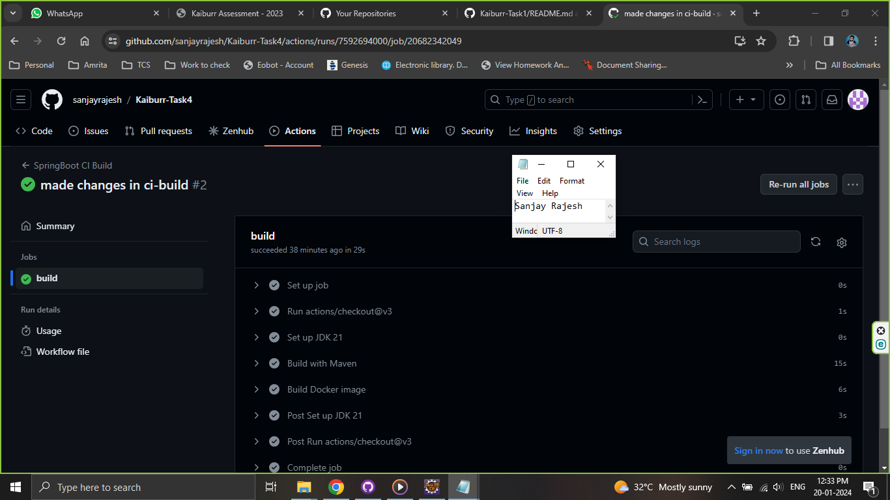

# Kaiburr-Task4
Task 4. CI-CD Pipeline


The CI build is done on the Task 1 code (spring boot API). Same code and Dockerfile created in Task 2 has been used here. We have used Github Actions to build the code and docker. For the `Actions workflow` the `Java with Maven` configuration has been selected since its a spring boot application running under Maven. The workflow yml file has been created under `.github/workflows/ci-build.yml`.

As required, the steps to include code build and docker build has been added in the yml file.

```
steps:
    - uses: actions/checkout@v3
    - name: Set up JDK 21
      uses: actions/setup-java@v3
      with:
        java-version: '21'
        distribution: 'temurin'
        cache: maven
    - name: Build with Maven
      run: mvn -B package -Dmaven.test.skip --file pom.xml
    - name: Build Docker image
      run: docker build -t task4 .
``` 

# Screenshots


